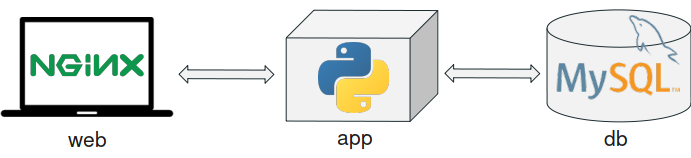

# Docker - Python - Flask - Nginx - MySQL

This application separate its functionality in three-tiers following a microservice architecture. This is a pretty common architecture for multi-service applications. Our application consists of:

- a UI tier – running on an nginx service
- a logic tier – the Python component
- a data tier – we use a mysql database to store some data we need in the logic tier.

